# AI Agent Skills Manifest & Intent Execution Engine

> **TARGET AUDIENCE: AI Coding Agents, LLMs, Subagents, and Autonomous Chains.**
> This manifest is a machine-oriented operational specification for all **57 skills** located in `.agents/skills/`.
> Use this document to resolve user intent, determine trigger validity, enforce hard execution gates, manage input/output contracts, and orchestrate multi-skill execution chains without hallucination.

---

## 1. Global AI Execution Rules & Hard Invariants

1. **Pre-Execution Gate:** If a skill defines a `<HARD-GATE>` or user approval requirement (e.g., `brainstorming`, `writing-plans`, `architecture-decision-records`, `prompt-optimizer`), the agent **MUST NOT** modify files or execute code before explicit user sign-off or authorization.
2. **Terminal Evidence Gate:** Work is never claimed "done" or "passing" based on reasoning alone. The agent **MUST** run the actual command and inspect live terminal output per `verification-before-completion`.
3. **The Iron Law of TDD:** No production code without a failing test first (`tdd-workflow`).
4. **Behavioral Discipline & Surgical Diffs:** Surface assumptions rather than silently guessing; touch only requested lines (`karpathy-guidelines`).
5. **Strict Scope Lock on Takeovers:** When inheriting unfamiliar or broken projects (`project-takeover-recovery`), enforce **zero features added, zero features removed**, zero credential loss (`.env` preservation), zero elided/truncated code (`full-output-enforcement`), and use `ponytail` for fix simplicity (stdlib/repo utils before new deps).
6. **Tiered Context Discipline:** Small builds use lightweight context (`mvp-context-kit`) leaning on `ponytail` YAGNI ladder by default; production systems use tiered memory (`project-context-system`) with doc-level pruning monitored by `context-budget` and periodic `ponytail-audit` passes.
7. **Immutability & Zero Placeholder Rule:** Never emit partial snippets, `// ... rest of code`, or untested mocks when modifying production files (`full-output-enforcement`).
8. **Minimalism Hierarchy (YAGNI):** Standard library > Existing repo utils > Native platform features > Minimal custom logic > Third-party dependencies (`ponytail`).
9. **Database & Infrastructure Integrity:** Verify Supabase changelog, enforce RLS policies, audit connection pooling, and profile queries before schema migrations (`supabase`, `supabase-postgres-best-practices`).
10. **Design Quality Bar:** Reject generic AI aesthetics; enforce distinctive typography, cohesive color palettes, spacing standards, and web accessibility guidelines (`frontend-design`, `ui-ux-pro-max`, `web-design-guidelines`).
11. **Prompt Optimization Advisory Invariant:** When optimizing prompts (`prompt-optimizer`), enforce a **Strict Advisory Halt**; diagnose gaps, elicit debug packets (Phase 1.5), dynamically match skills (Phase 3), and output full/quick prompt templates terminating immediately after Section 5 without executing the draft task.

---

## 2. Global Skill Routing & Orchestration Matrix

### Primary Workflow Chains

```mermaid
graph TD
    UserRequest([User Request / Prompt]) --> Triage{Triage & Ambiguity Check}
    
    %% Triage & Onboarding
    Triage -->|Vague / Shallow Ask| CR[clarifying-requests]
    Triage -->|Model Recommendation| SM[suggest-model]
    Triage -->|Prompt Optimization / Meta-Prompting| PO[prompt-optimizer v2.2.0]
    Triage -->|Unfamiliar Repo / Fresh Clone| CO[codebase-onboarding]
    Triage -->|Legacy / Handcrafted Repo| ILS[inherit-legacy-style]
    Triage -->|Inherited / Broken Codebase| PTR[project-takeover-recovery]
    Triage -->|Deep Multi-Angle Topic Search| DR[deep-research]
    Triage -->|ChatGPT/Gemini Memory Import| IM[import-memory]
    Triage -->|Prune Claude Chat Export| CF[chatlog-filter]
    
    %% Context & Docs Setup
    Triage -->|Fast MVP / Hackathon Setup| MVP[mvp-context-kit]
    Triage -->|Production SaaS Context System| PCS[project-context-system]
    
    %% Planning & Design
    CR --> Intent{Task Intent}
    CO --> Intent
    ILS --> Intent
    DR --> Intent
    PO -->|Copy & Run Optimized Prompt| Intent
    
    Intent -->|New Feature / Creative Idea| BS[brainstorming]
    Intent -->|High-Impact Backend / DB Spec| IDC[intent-driven-coding]
    Intent -->|Multi-Session Epic / Multi-PR| BP[blueprint]
    Intent -->|Single Feature Roadmap| WP[writing-plans]
    Intent -->|Architectural Decision| ADR[architecture-decision-records]
    Intent -->|Supabase Backend / Auth / Edge Func| SB[supabase]
    Intent -->|Postgres Query / Schema Optimization| SPB[supabase-postgres-best-practices]
    Intent -->|Build Custom MCP Server| MCP[mcp-builder]
    
    %% Design & Frontend
    Intent -->|Design Intelligence / 50+ Styles / Palettes| UPM[ui-ux-pro-max]
    Intent -->|Bespoke Production UI / Anti-Slop| FD[frontend-design]
    Intent -->|Editorial / Marketing / Awwwards| DTF[design-taste-frontend]
    Intent -->|Notion / Linear Calm / Document UI| MUI[minimalist-ui]
    Intent -->|Aerospace / Terminal / Brutalist UI| IBU[industrial-brutalist-ui]
    Intent -->|Audit & Refactor Existing UI| REP[redesign-existing-projects]
    Intent -->|Audit Web Guidelines / Accessibility| WDG[web-design-guidelines]
    Intent -->|Image / Mockup Translation| I2C[image-to-code]
    Intent -->|Generate UI Image Prompts| IGF[imagegen-frontend-web / mobile]
    Intent -->|Brand Kit & Luxury Guidelines| BK[brandkit]
    Intent -->|Google Stitch Generation Contract| ST[stitch-design-taste]
    
    %% Execution
    Intent -->|Before Writing New Code / Dep Search| SF[search-dependencies]
    Intent -->|Implement Code & Logic| TDD[tdd-workflow]
    Intent -->|Bug / Test Failure / Crash| SD[systematic-debugging]
    
    %% Simplicity & Code Review
    TDD --> SimplicityCheck{Simplicity & YAGNI Gate}
    SD --> SimplicityCheck
    SimplicityCheck -->|Enforce YAGNI / Stdlib First| PT[ponytail]
    SimplicityCheck -->|Track Necessary Tech Debt| PTD[ponytail-debt]
    
    %% Verification & Completion
    SimplicityCheck --> VBC[verification-before-completion]
    VBC --> FOE[full-output-enforcement]
    FOE --> FinalReview{Code Review & Governance}
    FinalReview -->|Review Incoming Diff| PTRV[ponytail-review]
    FinalReview -->|Receive Human / AI Code Review| RCR[receiving-code-review]
    FinalReview -->|Maintain Living Docs| LDG[living-docs-governance]
    FinalReview -->|Repo Tech Debt Scan| PTA[ponytail-audit]
    FinalReview -->|Audit Context Bloat| CB[context-budget]
```



---

## 3. Disambiguation & Conflict Resolution Matrix

| Scenario / Ambiguity | Use This Skill First | Rather Than | Why |
| :--- | :--- | :--- | :--- |
| **Prompt Engineering vs Immediate Task Execution** | `prompt-optimizer` | *(Direct Execution)* | `prompt-optimizer` analyzes prompt weaknesses, elicits debug evidence (Phase 1.5), and outputs an optimized prompt template with skill invocation prefixes. Strictly halts without executing the task. |
| **Vague prompt vs New Feature Design** | `clarifying-requests` | `brainstorming` | If the ask is a 1-liner with material unknowns, clarify first. Only switch to `brainstorming` once the general direction is bounded. |
| **Single-PR Plan vs Multi-PR Epic** | `writing-plans` | `blueprint` | Use `writing-plans` for immediate single-PR tasks (2-5 min steps). Use `blueprint` only for multi-session, multi-PR architecture roadmaps. |
| **General Supabase Task vs SQL/Index Optimization** | `supabase` | `supabase-postgres-best-practices` | Use `supabase` for general product tasks (Auth, Edge Functions, Storage, RLS, CLI). Use `supabase-postgres-best-practices` when deep-diving on slow queries, index design, or connection pool sizing. |
| **UI Design System Intelligence vs Bespoke Aesthetic Code** | `ui-ux-pro-max` | `frontend-design` | Use `ui-ux-pro-max` when selecting curated color palettes, font pairings, chart rules, or stack-specific design rules. Use `frontend-design` when coding bold, memorable, production-grade custom components. |
| **Audit Existing Web Guidelines vs Design Redesign** | `web-design-guidelines` | `redesign-existing-projects` | Use `web-design-guidelines` for automated lint-style checks against Web Interface Guidelines. Use `redesign-existing-projects` when overhauling entire page layouts. |
| **Model Selection vs Task Execution** | `suggest-model` | *(Execution skills)* | `suggest-model` only routes to the best model configuration in Antigravity/Claude. It never executes the underlying task. |
| **Chat Export Compacting vs Memory Vault** | `chatlog-filter` | `unified-memory` | `chatlog-filter` strips telemetry/abandoned branches from Claude JSON exports. `unified-memory` manages cross-harness persistent project memory. |
| **Code Library Search vs Topic Web Research** | `search-dependencies` | `deep-research` | `search-dependencies` checks npm/PyPI/GitHub before writing code. `deep-research` conducts multi-angle web research for domain knowledge or articles. |
| **External Memory Import vs Cross-Harness Memory Vault** | `import-memory` | `unified-memory` | `import-memory` parses ChatGPT/Gemini memory exports for assistant profile memory. `unified-memory` handles repo-level `.ecc/memory/` vault files. |
| **Coding Discipline vs General Code Standards** | `karpathy-guidelines` | `coding-standards` | `karpathy-guidelines` enforces surgical diffs, explicit assumptions, and anti-guesswork habits. `coding-standards` enforces naming, pure functions, and immutability. |
| **General UI vs Minimalist/Document UI** | `minimalist-ui` | `design-taste-frontend` | If user asks for Notion/Linear calm, document-style, or monochrome UI, use `minimalist-ui`. If user wants marketing, motion, or Awwwards feel, use `design-taste-frontend`. |
| **Diff Review vs Repo-wide Bloat Scan** | `ponytail-review` | `ponytail-audit` | `ponytail-review` inspects a PR or pending diff. `ponytail-audit` scans the entire repository tree. |

---

## 4. Comprehensive Skill Specifications (57 Skills)

```
================================================================================
CATEGORY 1: PLANNING, IDEATION & CONTEXT SETUP (6 Skills)
================================================================================
```

### 1. `brainstorming`
- **Canonical Path:** `.agents/skills/brainstorming/SKILL.md`
- **Semantic Intent:** Socratic dialogue to explore ideas, evaluate tradeoffs, and write specifications before implementation.
- **Hard Gate:** **HALT BEFORE WRITING CODE.** Do not touch source files until user approves design spec.
- **Input / Output:** Input: User concept. Output: `docs/specs/YYYY-MM-DD-<topic>-design.md`.

### 2. `clarifying-requests`
- **Canonical Path:** `.agents/skills/clarifying-requests/SKILL.md`
- **Semantic Intent:** Rapid front-door triage that extracts material vs. cosmetic unknowns from vague prompts, asking 1–3 focused questions in a single batch.
- **Positive Triggers:** Vague one-liners ("help me with auth", "make this faster", "improve my site").

### 3. `intent-driven-coding`
- **Canonical Path:** `.agents/skills/intent-driven-coding/SKILL.md`
- **Semantic Intent:** De-risks ambiguous or high-impact engineering changes by formalizing verifiable acceptance criteria and explicit edge cases.

### 4. `blueprint`
- **Canonical Path:** `.agents/skills/blueprint/SKILL.md`
- **Semantic Intent:** Generates cold-executable, multi-session construction plans broken into discrete PR-sized steps with dependency graphs.

### 5. `writing-plans`
- **Canonical Path:** `.agents/skills/writing-plans/SKILL.md`
- **Semantic Intent:** Authors an exhaustive, bite-sized implementation plan assuming zero prior context. Every step is 2–5 minutes of action.
- **Hard Gate:** Zero placeholders ("TBD", "TODO", "implement later" are banned).

### 6. `mvp-context-kit`
- **Canonical Path:** `.agents/skills/mvp-context-kit/SKILL.md`
- **Semantic Intent:** Ultra-lean, fast agent context setup for hackathons, weekend builds, prototypes, or 30-day programs. Uses a 1-file `AGENTS.md`, a per-feature `BUILD.md` checklist, and a 2-line `STATE.md`.
- **Ecosystem Coordination:**
  - Integrates `ponytail`'s YAGNI ladder by default.
  - Integrates `clarifying-requests` for fast entry-point triage.
  - Integrates `systematic-debugging` if features break mid-build.
  - Integrates `full-output-enforcement` and `verification-before-completion` before closing tasks.
  - Uses `context-budget` to trigger migration when docs grow past single-file limits.
- **Positive Triggers:** "Quick prototype", "hackathon build", "MVP", "30-day build", "just get me going fast without 10 doc files".

```
================================================================================
CATEGORY 2: CODING STANDARDS, ARCHITECTURE & GOVERNANCE (7 Skills)
================================================================================
```

### 7. `project-context-system`
- **Canonical Path:** `.agents/skills/project-context-system/SKILL.md`
- **Reference Files:** `references/file-templates.md`
- **Semantic Intent:** Bootstraps and maintains the full tiered agent-context engineering system for production/SaaS projects (`AGENTS.md`, `ARCHITECTURE.md`, `CONSTRAINTS.md`, `SECURITY.md`, `STATE.md`, `DECISIONS.md`, `TESTING.md`, `ROLLBACK.md`).
- **Ecosystem Coordination:**
  - Uses `context-budget` to monitor actual token loads against the ~100-line budget.
  - Integrates `intent-driven-coding` for Phase 2 feature specs.
  - Uses `ponytail-debt` to prevent duplicate shortcut tracking.
  - Runs `ponytail-review` on diffs before shipping features, and periodic `ponytail-audit` passes.
- **Positive Triggers:** Starting serious production projects, "give this project an agent memory system", retrofitting living documentation.

### 8. `karpathy-guidelines`
- **Canonical Path:** `.agents/skills/karpathy-guidelines/SKILL.md`
- **Reference Files:** `references/examples.md`
- **Semantic Intent:** Core behavioral discipline inspired by Andrej Karpathy: surface assumptions, simplicity first, surgical diffs, and verifiable success criteria.
- **Key Invariants:** Reproduce before fixing; never silently refactor adjacent code; executable proof over claims.

### 9. `architecture-decision-records`
- **Canonical Path:** `.agents/skills/architecture-decision-records/SKILL.md`
- **Semantic Intent:** Automatically detects architectural decision moments and documents them as lightweight Michael Nygard-format ADRs in `docs/adr/`.

### 10. `codebase-onboarding`
- **Canonical Path:** `.agents/skills/codebase-onboarding/SKILL.md`
- **Semantic Intent:** Performs structured reconnaissance on an unfamiliar repository, creating an architectural map, entry points guide, and starter `AGENTS.md` / `CLAUDE.md`.

### 11. `coding-standards`
- **Canonical Path:** `.agents/skills/coding-standards/SKILL.md`
- **Semantic Intent:** Cross-language baseline for descriptive naming, immutability, pure functions, AAA test structure, and code-smell elimination.

### 12. `inherit-legacy-style`
- **Canonical Path:** `.agents/skills/inherit-legacy-style/SKILL.md`
- **Semantic Intent:** Scans legacy or handcrafted code across 4 dimensions (file anatomy, state control, utils structure, error habits) to prevent AI style drift.

### 13. `living-docs-governance`
- **Canonical Path:** `.agents/skills/living-docs-governance/SKILL.md`
- **Semantic Intent:** Establishes a 4-role documentation taxonomy (Constitution, Map, Status, History) to prevent doc rot and zombie feature resurrection.

```
================================================================================
CATEGORY 3: SIMPLICITY & YAGNI (PONYTAIL SUITE) (4 Skills)
================================================================================
```

### 14. `ponytail`
- **Canonical Path:** `.agents/skills/ponytail/SKILL.md`
- **Semantic Intent:** Senior developer persona enforcing strict YAGNI ladder: Stdlib -> Native Platform -> One-Liner -> Minimal Code.

### 15. `ponytail-audit`
- **Canonical Path:** `.agents/skills/ponytail-audit/SKILL.md`
- **Semantic Intent:** Repository-wide bloat scanner detecting speculative generics, premature abstractions, dead dependencies, and mock-heavy tests.

### 16. `ponytail-debt`
- **Canonical Path:** `.agents/skills/ponytail-debt/SKILL.md`
- **Semantic Intent:** Lightweight, markdown-based technical debt management system using explicit expiration triggers.

### 17. `ponytail-review`
- **Canonical Path:** `.agents/skills/ponytail-review/SKILL.md`
- **Semantic Intent:** Pre-merge simplicity gate reviewing diffs against the 5 Ponytail Maxims.

```
================================================================================
CATEGORY 4: TESTING, DEBUGGING, VERIFICATION & TAKEOVER RECOVERY (6 Skills)
================================================================================
```

### 18. `tdd-workflow`
- **Canonical Path:** `.agents/skills/tdd-workflow/SKILL.md`
- **Semantic Intent:** Test-Driven Development orchestrator enforcing RED -> GREEN -> REFACTOR cycles.

### 19. `systematic-debugging`
- **Canonical Path:** `.agents/skills/systematic-debugging/SKILL.md`
- **Supporting Files:** `backend-debugging.md`, `frontend-debugging.md`, `root-cause-tracing.md`, `defense-in-depth.md`, `condition-based-waiting.md`, `find-polluter.sh`
- **Semantic Intent:** 4-phase root-cause debugging protocol banning symptom guessing. Enforces minimal reproductions, multi-layer diagnostic logs, condition-based waiting, and a 3-strike architectural halt rule.

### 20. `verification-before-completion`
- **Canonical Path:** `.agents/skills/verification-before-completion/SKILL.md`
- **Semantic Intent:** Mandatory terminal verification protocol prohibiting "it should work now" claims without live command evidence.

### 21. `full-output-enforcement`
- **Canonical Path:** `.agents/skills/full-output-enforcement/SKILL.md`
- **Semantic Intent:** Hard constraint preventing lazy code omissions (`// ... rest of code`), partial files, and truncated replacements.

### 22. `project-takeover-recovery`
- **Canonical Path:** `.agents/skills/project-takeover-recovery/SKILL.md`
- **Semantic Intent:** 5-phase emergency takeover protocol for broken, abandoned, or partially implemented codebases. Enforces zero feature changes during triage.

### 23. `search-dependencies`
- **Canonical Path:** `.agents/skills/search-dependencies/SKILL.md`
- **Semantic Intent:** Research-before-coding protocol querying npm, PyPI, and GitHub before writing custom utilities.

```
================================================================================
CATEGORY 5: BACKEND, DATABASE & INFRASTRUCTURE (3 Skills)
================================================================================
```

### 24. `supabase`
- **Canonical Path:** `.agents/skills/supabase/SKILL.md`
- **Semantic Intent:** End-to-end Supabase product orchestrator covering Database, Auth, SSR cookies (`@supabase/ssr`), Edge Functions, Storage, Realtime, Logs Explorer, RLS policies, and migrations.
- **Key Invariants:** Always verify changelog (`https://supabase.com/changelog.md`), run verification queries after migrations, and inspect error logs on failures.
- **Positive Triggers:** Any Supabase tasks, auth debugging, RLS issues, Supabase CLI/migrations, edge function crashes.

### 25. `supabase-postgres-best-practices`
- **Canonical Path:** `.agents/skills/supabase-postgres-best-practices/SKILL.md`
- **Semantic Intent:** Comprehensive Postgres performance optimization across 8 prioritized categories (query performance, connection management, schema design, RLS, composite/partial indexing, vacuum/analyze).
- **Positive Triggers:** Slow database queries, high CPU on Postgres, connection pool exhaustion, missing indexes, RLS performance tuning.

### 26. `mcp-builder`
- **Canonical Path:** `.agents/skills/mcp-builder/SKILL.md`
- **Semantic Intent:** Guide for building production-grade Model Context Protocol (MCP) servers using FastMCP (Python) or TypeScript MCP SDK.
- **Positive Triggers:** "Build an MCP server", "create custom MCP tool", "integrate external API as MCP".

```
================================================================================
CATEGORY 6: CODE REVIEW & META-QUALITY (3 Skills)
================================================================================
```

### 27. `receiving-code-review`
- **Canonical Path:** `.agents/skills/receiving-code-review/SKILL.md`
- **Semantic Intent:** Structured protocol for handling code review feedback without blindly accepting or pushback.

### 28. `skill-stocktake`
- **Canonical Path:** `.agents/skills/skill-stocktake/SKILL.md`
- **Semantic Intent:** Diagnostic auditor that benchmarks and audits all workspace skills for quality, trigger reliability, and documentation freshness.

### 29. `skill-creator`
- **Canonical Path:** `.agents/skills/skill-creator/SKILL.md`
- **Semantic Intent:** Meta-skill for authoring, evaluating, and improving agent skills with benchmark eval suites.

```
================================================================================
CATEGORY 7: FRONTEND, UI & VISUAL DESIGN (12 Skills)
================================================================================
```

### 30. `design-taste-frontend`
- **Canonical Path:** `.agents/skills/design-taste-frontend/SKILL.md`
- **Semantic Intent:** Anti-slop frontend styling engine for modern landing pages, SaaS marketing, and dynamic UI with bold typography and smooth micro-animations.

### 31. `frontend-design`
- **Canonical Path:** `.agents/skills/frontend-design/SKILL.md`
- **Semantic Intent:** Builds distinctive, production-grade frontend interfaces with strong aesthetic point-of-view, avoiding generic AI layouts and corporate cliches.
- **Positive Triggers:** "Build frontend component", "create beautiful web UI", "style this dashboard", "make this page visually striking".

### 32. `ui-ux-pro-max`
- **Canonical Path:** `.agents/skills/ui-ux-pro-max/SKILL.md`
- **Semantic Intent:** Comprehensive design intelligence system featuring 50+ design styles, 161 color palettes, 57 font pairings, 161 product types, and 99 UX guidelines across 10 stacks (React, Next.js, Vue, Tailwind, shadcn/ui, SwiftUI, Flutter).
- **Positive Triggers:** "Design UI", "pick color palette", "choose font pairing", "UX guidelines", "accessible button states", "chart selection".

### 33. `web-design-guidelines`
- **Canonical Path:** `.agents/skills/web-design-guidelines/SKILL.md`
- **Semantic Intent:** Audits frontend code against Web Interface Guidelines, delivering concise `file:line` findings for accessibility, layout hierarchy, and UX standards.
- **Positive Triggers:** "Review my UI", "check accessibility", "audit design", "review UX against best practices".

### 34. `minimalist-ui`
- **Canonical Path:** `.agents/skills/minimalist-ui/SKILL.md`
- **Semantic Intent:** High-density, calm productivity UI inspired by Linear, Notion, and macOS utilities.

### 35. `industrial-brutalist-ui`
- **Canonical Path:** `.agents/skills/industrial-brutalist-ui/SKILL.md`
- **Semantic Intent:** High-density mechanical interface design fusing Swiss typographic print with aerospace telemetry and military terminal aesthetics.

### 36. `redesign-existing-projects`
- **Canonical Path:** `.agents/skills/redesign-existing-projects/SKILL.md`
- **Semantic Intent:** Upgrades existing web projects through a 3-step audit (Scan -> Diagnose -> Fix) supporting 3 tiers: Tier 1 (Student/Bootcamp), Tier 2 (Pro SaaS), Tier 3 (Premium Agency).

### 37. `image-to-code`
- **Canonical Path:** `.agents/skills/image-to-code/SKILL.md`
- **Semantic Intent:** Multimodal design translation protocol that generates/analyzes UI reference images and produces pixel-accurate responsive frontend code.

### 38. `imagegen-frontend-web`
- **Canonical Path:** `.agents/skills/imagegen-frontend-web/SKILL.md`
- **Semantic Intent:** Section-by-section website image prompt generator (strictly 1 separate image per page section).

### 39. `imagegen-frontend-mobile`
- **Canonical Path:** `.agents/skills/imagegen-frontend-mobile/SKILL.md`
- **Semantic Intent:** Mobile app screen concept generator that produces native iOS and Android flows framed within smartphone bezels.

### 40. `brandkit`
- **Canonical Path:** `.agents/skills/brandkit/SKILL.md`
- **Semantic Intent:** Visual identity prompt specialist for generating luxury brand guidelines, logo systems, typography boards, and identity decks.

### 41. `stitch-design-taste`
- **Canonical Path:** `.agents/skills/stitch-design-taste/SKILL.md`
- **Semantic Intent:** Generates semantic `DESIGN.md` guidelines tailored specifically for Google Stitch screen generation.

```
================================================================================
CATEGORY 8: AGENT OPTIMIZATION, MODEL ROUTING & MEMORY (7 Skills)
================================================================================
```

### 42. `prompt-optimizer` (v2.2.0)
- **Canonical Path:** `.agents/skills/prompt-optimizer/SKILL.md`
- **Semantic Intent:** 7-phase advisory prompt engineering pipeline that critiques draft prompts, diagnoses gaps, executes specialized debug evidence elicitation (Phase 1.5), dynamically matches installed workspace skills (Phase 3), and authors comprehensive + streamlined optimized prompt templates with skill invocation prefixes.
- **7-Phase Execution Pipeline:**
  1. **Phase 0:** Project & Environment Detection (scans project manifests & `AGENTS.md`/`ARCHITECTURE.md` conventions).
  2. **Phase 1:** Intent & Category Detection (New Feature, Bug Fix / Debugging, Refactoring, Research/Audit, Testing, Docs/PRD, Database/Schema, UI/UX).
  3. **Phase 1.5:** Debug Evidence Elicitation *(Bug Fix only)* (resolves domain, symptoms, repro steps, verbatim stack traces, recent git changes, environment, affected files, prior fix attempt count).
  4. **Phase 2:** Structural Prompt Audit & Diagnosis (identifies missing context, ambiguities, anti-patterns).
  5. **Phase 3:** Dynamic Workspace Skills Analysis & Matching (recommends Primary Execution Drivers, Quality Guardrails, Domain Specialists, and Invocation Prefixes; `systematic-debugging` is mandatory for bugs).
  6. **Phase 4:** Missing Context & Gap Detection (scans scope, acceptance criteria, edge cases, verification methods).
  7. **Phase 5:** Workflow & Lifecycle Recommendation (Discovery -> Plan -> TDD -> Review -> Verify -> Docs).
  8. **Phase 6:** Optimized Prompt Synthesis (Full Structured Prompt [self-contained debug packet with 3+ attempt architectural warnings] + Quick Streamlined Prompt).
- **Hard Gate:** **STRICT ADVISORY HALT.** Must NEVER execute the draft task, write solution code, run commands, or answer the underlying request. Response must strictly terminate immediately after Section 5 (Enhancement Rationale).
- **Positive Triggers:** "Optimize prompt", "improve my prompt", "rewrite this prompt", "how to write a prompt for", "what skill to use with this prompt", "recommend skills for prompt", `/prompt-optimize`.
- **Negative Triggers:** Direct execution asks ("just do it"), code refactoring ("optimize performance", "optimize this code").

### 43. `suggest-model`
- **Canonical Path:** `.agents/skills/suggest-model/SKILL.md`
- **Semantic Intent:** Antigravity model router that classifies task requirements and recommends the optimal model + reasoning tier (e.g. Gemini 3.7 Flash Thinking, Claude Sonnet 4.6, GPT-OSS 120B).
- **Hard Gate:** **ROUTING ONLY.** Recommends a model with benchmark justifications; never attempts the task itself.
- **Positive Triggers:** "Suggest a model", "which model should I use for X", "what should I run this on", "pick a model".

### 44. `chatlog-filter`
- **Canonical Path:** `.agents/skills/chatlog-filter/SKILL.md`
- **Supporting Scripts:** `scripts/filter_chatlog.py`
- **Semantic Intent:** Strips telemetry, structural metadata, internal feature flags, and abandoned edit/regeneration branches from Claude chat export JSONs while preserving 100% of substantive thinking, code, and messages.
- **Positive Triggers:** "Filter chat export", "clean conversation json", "prune claude export", "make chat export smaller".

### 45. `context-budget`
- **Canonical Path:** `.agents/skills/context-budget/SKILL.md`
- **Semantic Intent:** Diagnostic skill that measures token consumption across agents, skills, and tools, pinpointing context bloat.

### 46. `unified-memory`
- **Canonical Path:** `.agents/skills/unified-memory/SKILL.md`
- **Semantic Intent:** Cross-agent durable memory protocol storing context in portable `ecc.memory.v1` format.

### 47. `import-memory`
- **Canonical Path:** `.agents/skills/import-memory/SKILL.md`
- **Semantic Intent:** Dedicated conversational importer for parsing pasted memory exports from ChatGPT, Gemini, or other assistants safely into profile memory.

### 48. `deep-research`
- **Canonical Path:** `.agents/skills/deep-research/SKILL.md`
- **Semantic Intent:** Autonomous deep web research orchestrator that formulates search strategies, crawls sources, validates claims, and compiles synthesis reports.

```
================================================================================
CATEGORY 9: DOCUMENT AUTOMATION, MEDIA & API TOOLING (9 Skills)
================================================================================
```

### 49. `docx`
- **Canonical Path:** `.agents/skills/docx/SKILL.md`
- **Semantic Intent:** Enterprise Word document (.docx/.dotx) authoring, editing, table of contents formatting, tracked changes redlining, and ECMA-376 schema validation.
- **Positive Triggers:** "Generate Word doc", "create .docx report", "edit document with track changes", "official printable exam paper".

### 50. `xlsx`
- **Canonical Path:** `.agents/skills/xlsx/SKILL.md`
- **Semantic Intent:** Spreadsheet (.xlsx/.xlsm) creation, formulas, pandas data pipelines, and strict formula recalculation with zero error tolerance (`recalc.py`).
- **Positive Triggers:** "Create Excel sheet", "calculate student grades .xlsx", "import spreadsheet marks", "fix excel formulas".

### 51. `pdf`
- **Canonical Path:** `.agents/skills/pdf/SKILL.md`
- **Semantic Intent:** PDF form inspection, fillable field automation, bounding-box coordinate checks, OCR annotations, and page conversions.
- **Positive Triggers:** "Fill PDF form", "extract text from PDF", "inspect PDF layout", "convert PDF pages to images".

### 52. `pptx`
- **Canonical Path:** `.agents/skills/pptx/SKILL.md`
- **Semantic Intent:** PowerPoint presentation deck generation, slide layout templating, chart embedding, and PresentationML schema validation.
- **Positive Triggers:** "Create slide deck", "presentation .pptx", "competition pitch slides".

### 53. `claude-api`
- **Canonical Path:** `.agents/skills/claude-api/SKILL.md`
- **Semantic Intent:** Comprehensive multi-language API reference for prompt caching, token counting, tool use definitions, and streaming architectures across TypeScript, Python, and cURL.
- **Positive Triggers:** "How to use prompt caching", "Claude API token counting", "tool-calling schema reference".

### 54. `canvas-design`
- **Canonical Path:** `.agents/skills/canvas-design/SKILL.md`
- **Semantic Intent:** Visual layout principles for poster and certificate design, packaged with 54 production-grade open-source OFL font families.
- **Positive Triggers:** "Design certificate poster", "render high-res visual art", "typography layout".

### 55. `internal-comms`
- **Canonical Path:** `.agents/skills/internal-comms/SKILL.md`
- **Semantic Intent:** Structured templates for engineering status reports, incident postmortems, leadership briefings, and company newsletters.
- **Positive Triggers:** "Draft status report", "write postmortem", "internal stakeholder update".

### 56. `algorithmic-art`
- **Canonical Path:** `.agents/skills/algorithmic-art/SKILL.md`
- **Semantic Intent:** Interactive generative art, flow fields, and mathematical curves rendered using p5.js.
- **Positive Triggers:** "Generate p5.js art", "math visualization curve", "generative particle flow".

### 57. `slack-gif-creator`
- **Canonical Path:** `.agents/skills/slack-gif-creator/SKILL.md`
- **Semantic Intent:** Programmatic animated GIF generation with frame easing, color quantization, and Slack dimensions.
- **Positive Triggers:** "Create animated GIF", "render step-by-step animation".

---

## 5. Summary Table of Artifacts Produced by Skills

| Artifact File Path | Producing Skill | Purpose |
| :--- | :--- | :--- |
| `docs/specs/YYYY-MM-DD-<topic>-design.md` | `brainstorming` | Validated feature design specification |
| `docs/plans/YYYY-MM-DD-<feature>.md` | `writing-plans` | Bite-sized single-PR implementation roadmap |
| `plans/<name>.md` | `blueprint` | Multi-session / multi-agent epic construction plan |
| `RECON.md` & `FEATURE-AUDIT.md` | `project-takeover-recovery` | Codebase inventory and feature audit table |
| `HANDOVER.md` | `project-takeover-recovery` | Final verified handover and environment summary |
| `ARCHITECTURE.md` / `CONSTRAINTS.md` / `SECURITY.md` | `project-context-system` | Foundational production context layer |
| `STATE.md` (root) | `project-context-system` / `mvp-context-kit` | Living session state tracker (rewritten each session) |
| `BUILD.md` (root or `docs/build/`) | `mvp-context-kit` | Fast per-feature checklist and verification criterion |
| `docs/adr/NNNN-<decision-title>.md` | `architecture-decision-records` | Architectural Decision Record |
| `docs/adr/README.md` | `architecture-decision-records` | Chronological ADR index table |
| `.ai-style-rules.md` | `inherit-legacy-style` | Machine-readable style rules for legacy codebase |
| `AGENTS.md` / `CLAUDE.md` | `codebase-onboarding` | Master harness instruction entry points |
| `docs/testing/<task>.tdd.md` | `tdd-workflow` | TDD evidence and validation report |
| `DESIGN.md` | `stitch-design-taste` | Visual design prompt contract for Google Stitch |
| `supabase/migrations/<timestamp>_<name>.sql` | `supabase` | Version-controlled Supabase database migration |
| `<server_name>/server.py` / `src/index.ts` | `mcp-builder` | Production MCP server implementation |
| `<name>.filtered.json` | `chatlog-filter` | Compacted, pruned Claude conversation transcript |\n